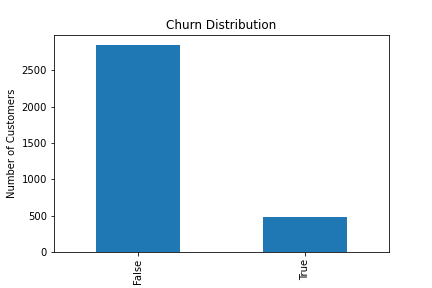
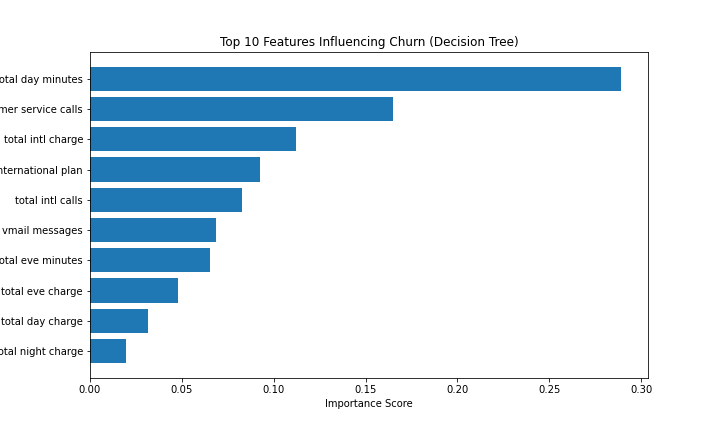
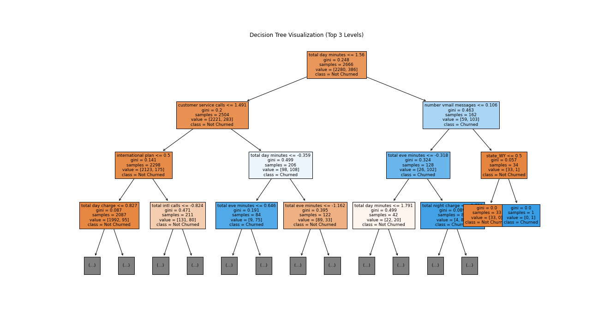
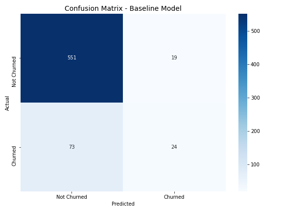
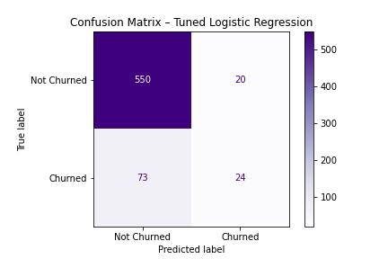
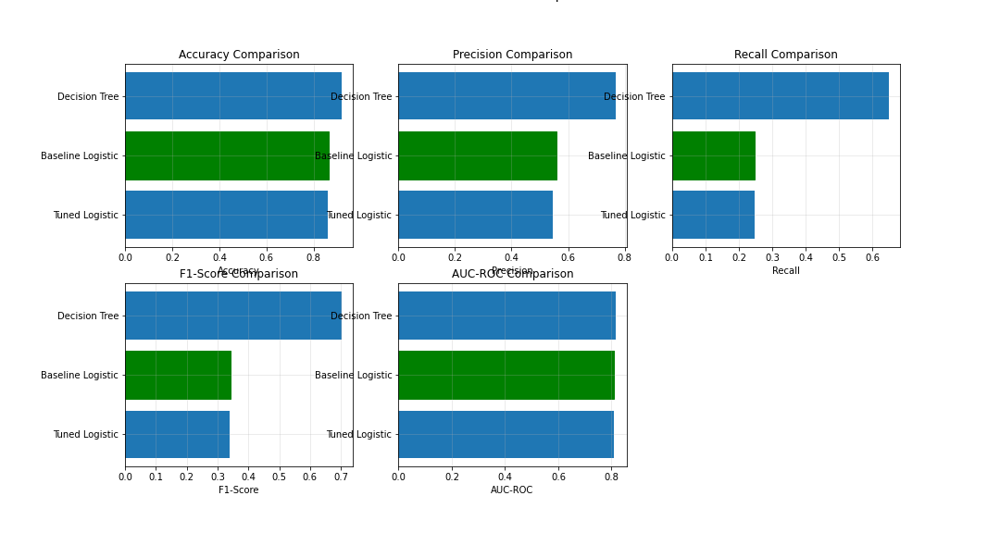
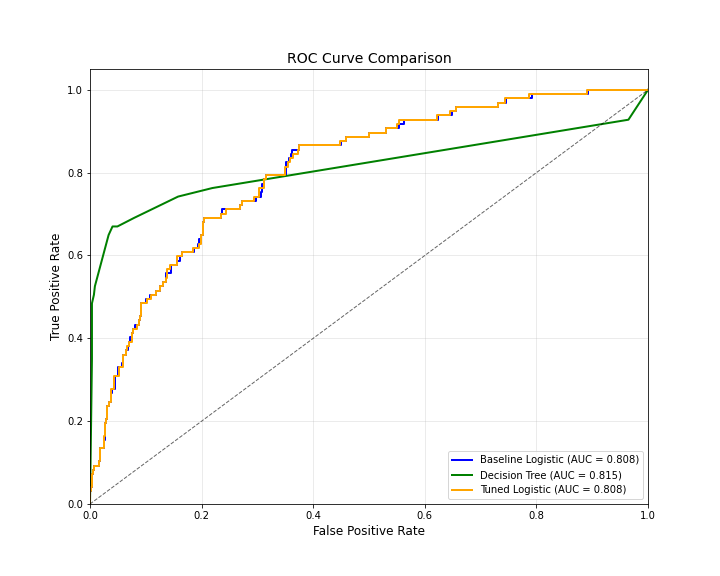

# SyriaTel Customer Churn Prediction

## Overview
SyriaTel, a leading telecommunications company, faces a significant business challenge: customer churn. Churn occurs when customers discontinue their service, leading to lost revenue, reduced profitability, and slower growth. This project addresses this issue by developing a **predictive machine learning model** to identify customers at risk of leaving. 

By forecasting churn, SyriaTel can implement proactive retention strategies such as targeted promotions, personalized engagement, or service improvements, ultimately safeguarding revenue and improving customer satisfaction.

---

## Business and Data Understanding
**Stakeholder Audience:**  
The primary stakeholders are SyriaTel’s business managers, marketing teams, and customer retention teams. Their goal is to reduce churn and allocate retention resources efficiently.

**Business Problem:**  
Customer churn is costly, and identifying at-risk customers early allows SyriaTel to act before revenue is lost. Retention campaigns must be precise due to limited budgets, and not all dissatisfied customers will actually churn.

**Dataset:**  
The dataset `bigml_59c28831336c6604c800002a.csv` – contains customer-level information including usage patterns, service plans, account details, and a target variable indicating whether a customer has churned. It includes both numerical and categorical features relevant to customer behavior and service engagement.

Key insights from initial data exploration include:
- Presence of class imbalance in the target variable (fewer churned customers than non-churned).  
- Several categorical features requiring encoding for model compatibility.  
- Variability in numerical features that benefits from scaling for consistent modeling.  

**Churn Distribution:**  

---

## Modeling
To address the churn problem effectively, an **iterative modeling approach** was employed:

1. **Baseline Model: Logistic Regression**  
   - Provides a transparent and interpretable benchmark.
   - Offers insight into which customer features most influence churn.

2. **Decision Tree Classifier**  
   - Captures non-linear relationships between features and churn.
   - Provides an intuitive, visual representation of decision paths for stakeholder understanding.

3. **Tuned Logistic Regression**  
   - Optimized hyperparameters improve predictive performance while retaining interpretability.
   - Selected as the **final model** for practical deployment due to its balance of precision, recall, and business impact.

**Feature Preparation and Processing:**  
- Categorical features were encoded using label encoding (binary) or one-hot encoding (multi-class).  
- Numerical features were standardized to ensure consistent scale for modeling.  
- The dataset was split into training (80%) and testing (20%) sets, maintaining class distribution.

**Decision Tree Feature Importance:**  

**Decision Tree Visualization:**  

---

## Evaluation
Model performance was evaluated using **multiple classification metrics**, chosen based on the business context of minimizing missed churn cases:

| Metric | Purpose |
|--------|---------|
| Accuracy | Overall correctness of predictions |
| Precision | Correctness of predicted churn (avoiding false alarms) |
| Recall | Ability to identify actual churners (critical for retention) |
| F1-Score | Balance between precision and recall |
| ROC-AUC | Discrimination between churned and non-churned customers |

**Baseline Logistic Regression Confusion Matrix:**  

**Tuned Logistic Regression Confusion Matrix:**  

**Model Performance Comparison:**  

**ROC Curve Comparison:**  

**Key Findings:**  
- **Tuned Logistic Regression** achieved the highest F1-score and ROC-AUC, making it the most effective model for detecting at-risk customers.  
- Decision Tree provided intuitive insights into top features influencing churn, such as account tenure, usage patterns, and service type.  
- Confusion matrices highlighted both correctly identified churners and false alarms, informing potential retention campaign targeting.

**Business Impact Analysis:**  
- The model can correctly identify a substantial portion of churners, allowing focused retention strategies.  
- Financial estimates suggest **significant potential savings** from prevented churn when retention efforts are applied effectively, with positive ROI projections.

---

## Conclusion
This project demonstrates that customer churn at SyriaTel can be effectively predicted using a structured, interpretable machine learning workflow. Key conclusions include:

- A combination of **baseline models, interpretable decision trees, and tuned logistic regression** provides both predictive power and actionable insights.  
- Feature importance analysis enables stakeholders to understand which customer attributes most influence churn.  
- Predictive modeling supports proactive retention campaigns, maximizing revenue protection and operational efficiency.  

**Limitations and Future Work:**  
- Current analysis relies on static historical data and does not incorporate temporal trends or customer interaction logs.  
- External factors such as market conditions and competitor activity were not included.  
- Future improvements could involve advanced imbalance-handling techniques, time-series analysis, or richer customer behavior features to enhance predictive accuracy and business impact.

---
For more detailed analysis, pleaase check the notebook ,[Jupyter Notebook](index.ipynb)

